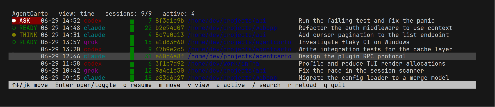
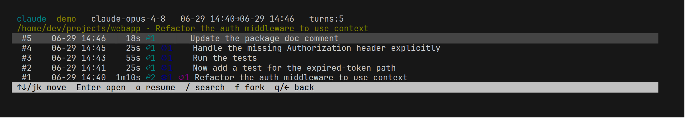

# AgentCarto

A terminal UI that brings the local sessions of **all your AI coding agents** into one
searchable place — Claude Code, Codex, Grok, and GitHub Copilot Chat. AgentCarto reads
each agent's history straight from disk and normalizes it into a common model of turns
and rewind/fork branches, so you can browse, search, inspect, resume, fork, and relocate
sessions across agents from a single list.



## What you can do

### Browse every agent in one list
- All sessions from Claude Code, Codex, Grok, and Copilot Chat side by side — sorted by
  recency, or grouped by project (working directory).
- Each row shows the agent, time, message count, working directory, and title.

### Search across everything
- Full-text search over titles, working directories, agent names, and the actual
  **conversation bodies** — not just metadata.
- Switch between a time view and a per-project view; filter to only active sessions.

### See what's running right now
Live status for the sessions an agent is currently working on — detected from the agent's
own processes, no integration required:

| Glyph | Status | Meaning |
|---|---|---|
| `●` | `RUN` | The agent is actively processing |
| `●` | `THINK` | Reasoning or streaming a reply |
| `●` | `TOOL` | Running a tool |
| `●` | `ASK` | Waiting for **your** approval (a permission prompt) |
| `○` | `READY` | The process is alive but idle, ready for input |
| `·` | `OTHER` | Some other live state |

No marker means the session isn't currently active.

### Read conversations turn by turn
Open a session to inspect its conversation. Each row is one turn (`#N`, newest first) with
its elapsed time and compact markers for what happened; expand a turn to read the full
text, or step along its branches.



| Symbol | Meaning |
|---|---|
| `1m10s` | turn duration (or time elapsed, if still running) |
| `↩N` | assistant replies |
| `⚙N` | tool calls |
| `*N` `+N` `-N` | files changed, lines added, lines removed |
| `↺N` | rewind/fork branches off this turn |
| `▶N` | queued inputs (typed but not yet sent) |
| `⤷N` | background task / sub-agent notifications |

### Act on a session (where the agent supports it)
- **Resume** a session in its own agent, right from the list.
- **Fork** from any turn into a brand-new session — the original is never modified.
- **Relocate** a project's sessions to a new path, applied as a validated, atomic write.

### Stay safe and local
Browsing, search, and status are **read-only**; the only writes are the fork and relocate
actions you confirm. Conversations are cached in a local SQLite database and never leave
your machine.

## Supported agents

| Agent | Browse | Status | Resume | Fork | Relocate |
|---|---:|---:|---:|---:|---:|
| Claude Code | ✓ | ✓ | ✓ | ✓ | ✓ |
| Codex | ✓ | ✓ | ✓ | ✓ | ✓ |
| Grok | ✓ | ✓ | ✓ | ✓ | ✓ |
| GitHub Copilot Chat (VS Code / JetBrains) | ✓ | — | — | — | — |

Copilot Chat data is read-only (AgentCarto never writes to IDE-managed files).

## Install

Download the prebuilt binaries (host + all plugins) for your machine from the latest
release and install them into one directory — no Go or git needed (Linux/macOS):

```sh
curl -fsSL https://raw.githubusercontent.com/agentcarto/agentcarto/main/install.sh | sh
```

Installs to `~/.local/bin` by default (override with `PREFIX=/usr/local/bin`). Then run
`agentcarto`. Windows users can grab the `.zip` from the
[releases page](https://github.com/agentcarto/agentcarto/releases).

## Usage

Launch the TUI with `agentcarto`, or use the CLI directly:

```text
agentcarto                  launch the TUI
agentcarto list             list sessions
agentcarto active           list running sessions
agentcarto config validate  validate config and list enabled plugins
agentcarto plugins list     list plugins and capabilities
agentcarto doctor           diagnose config, executables, and storage
agentcarto cache stats|clear
```

Global flags go before the subcommand, e.g. `agentcarto --config ./config.yaml list` or
`agentcarto --no-cache list`.

**Keys** — List: `j`/`k` move, `g`/`G` top/bottom, `Enter` open, `/` search, `v` switch
time/project view, `a` active-only, `o` resume, `m` relocate, `q` quit. Detail: `j`/`k`
select turn, `Enter` expand, `f` fork from a turn, `q`/`←` back.

## Configuration

AgentCarto works out of the box; configure it only if you want to. Settings merge in
this order (later wins): built-in defaults → a `config.yaml` next to the executable → the
OS user-config file → a `--config` file.

| Location | Path |
|---|---|
| Next to the executable | `<dir of agentcarto>/config.yaml` |
| User (Linux) | `$XDG_CONFIG_HOME/agentcarto/config.yaml` or `~/.config/agentcarto/config.yaml` |
| User (macOS) | `~/Library/Application Support/agentcarto/config.yaml` |
| User (Windows) | `%AppData%\agentcarto\config.yaml` |

[`config.example.yaml`](./config.example.yaml) is a ready-to-use starting point (set each
agent's storage directory and executable, colors, cache size, …). Validate a file with
`agentcarto config validate`.

## How it works

Each agent is a separate **plugin executable**. AgentCarto launches the plugins as
subprocesses and talks to them over
[hashicorp/go-plugin](https://github.com/hashicorp/go-plugin) (net/rpc + gob). Plugins are
isolated (a crash or a missing plugin can't take down the host), independently buildable,
and new agents can be added without rebuilding AgentCarto. Shared types live in a small
`core` SDK.

| Repo | Module | Builds | Role |
|---|---|---|---|
| `agentcarto` | `github.com/agentcarto/agentcarto` | `agentcarto` | host: TUI, scan, cache, config, plugin launching |
| `core` | `github.com/agentcarto/core` | _(library)_ | SDK: domain, plugin (RPC bridge), scan, conversation, transaction, common |
| `plugin-claude` | `github.com/agentcarto/plugin-claude` | `agentcarto-plugin-claude` | Claude Code |
| `plugin-codex` | `github.com/agentcarto/plugin-codex` | `agentcarto-plugin-codex` | Codex |
| `plugin-grok` | `github.com/agentcarto/plugin-grok` | `agentcarto-plugin-grok` | Grok |
| `plugin-copilot` | `github.com/agentcarto/plugin-copilot` | `agentcarto-plugin-copilot-vc` / `-jb` | Copilot Chat |

Dependencies flow `plugin-* → core ← agentcarto` (no cycle). The host finds each plugin
binary via `plugins[].command` in config, then `agentcarto-plugin-<type>` next to the
`agentcarto` binary, then `PATH`.

## Safety

- Browsing, search, and status detection are entirely read-only.
- Fork creates a new session and never touches the original.
- Relocate validates a plan first, refuses to touch paths outside a plugin's declared
  storage, and uses atomic temp-file replacement.
- Resuming or relocating a running session is refused.
- Conversation data is never sent over the network; `--no-cache` skips the local cache.

## Build from source

Requires Go 1.24+ (Linux, macOS, Windows; amd64/arm64; no CGO). Clone the repos side by
side, then build the host and all plugin executables into `bin/`:

```sh
make build      # bin/agentcarto + bin/agentcarto-plugin-*
make run        # build and launch the TUI
make check      # build + test across every repo
```

Without `make`, build `./cmd/agentcarto` and each `../plugin-*/cmd/agentcarto-plugin-*`
into the same directory. A Go workspace (`go work init ./agentcarto ./core ./plugin-*`)
is handy for cross-module development.
